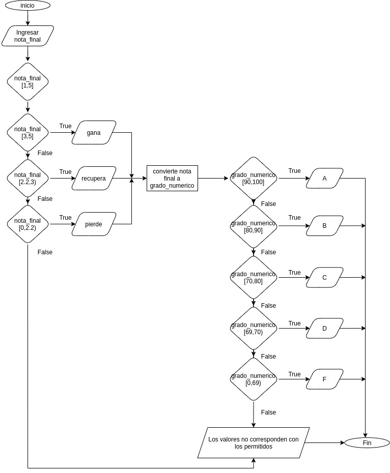

# Método IDEAL

## Identificar
* Cual es el problema?
  
  Queremos gestionar las notas de los estudiantes y obtener su equivalencia en el sistema americano.

* Cuales son los interesados?

  Institución educativa

* Cual es el objetivo?

  Identificar si un estudiante pierde, gana o debe recuperar una materia.  Asi como también saber su equivalencia en el sistema americano.

* Existen restricciones?

  * La nota final debe estar en el rango de 0.0 y 5.0

## Definir

  * Que conozco?

    * La nota final
    * La equivalencia en el sistema americano

      `grado_numerico = nota_final * 100 / 5`

  * Que debo conocer?

    * mensaje de si gana, pierde o recupera.
    * La nota equivalente en el sistema americano.

  * Dividir el problema en subproblemas

    * Funcion para calcular si se gana, pierde o recupera la materia.
    * Función que calcule la letra equivalente en el sistema americano.

## Estrategia

  * Hacer ejemplos particulares para entender el problema y sus subproblemas.

    * Si un estudiante obtiene 5 en su nota final, debe aparecer un mensaje que diga que ganó la materia y su equivalencia en el sistema americano igual a A.

    * Si un estudiante obtiene 0 en su nota final, debe aparecer un mensaje que diga que perdió la materia y su equivalencia en el sistema americano igual a F.

    * Si se ingresa una nota de 6 en su nota final, debe aparecer un mensaje que diga debe ingresar un número contenido en el rango indicado.  Y que imprima un mensaje de error.

  * Identificar opciones y estrategias de solución general.

    * Realizar una comprobación inicial, para verificar que la nota pertenece al rango permitido.

    * Verificar si la nota esta en un grupo especìfico y generar un mensaje con el dato de si pierde, gana o recupara la materia.

    * Convertir la nota obtenida a su equivalente americano u clasificarla en el grupo de letra que le corresponda.

## Algoritmo

  * Especificar requisitos para cada subproblemas.
  * Escribir algoritmos para cada requisito.
  * Escribir el algoritmo general.
    
    
    
  * Realizar pruebas de escritorio.

## Logro --> Programa

  * Programar los algoritmos en Python.
  * Probar el programa.
