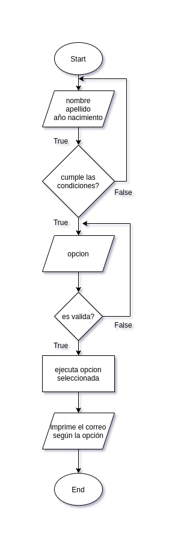

#Método IDEAL

## Identificar
* Cual es el problema?
  
  Se requiere generar direcciones de correo para cada estudiante de _Misión TIC_.

* Cuales son los interesados?

  Jefe de sistemas de la Misión TIC.

* Cual es el objetivo?

  Generar dirección de correo electrónico para cada estudiante, partiendo de los datos de cada usuario.

* Existen restricciones?

  * Los datos de los usuarios deben ser solamente caracteres alfanuméricos.
  * La opción solo puede estar como un entero de 1 a 3.
  * Las letras del correo solo pueden ser minúsculas.
  * El correo no debe contener espacios.

## Definir

  * Que conozco?

    * Nombre
    * Apellido
    * Año de nacimiento
    * Opción
      1. inicial_nombreinicial_apellido1@misiontic.com
      2. primeras_3_letras_nombre+primeras_2_letras_apellido@misiontic.com
      3. primeras_3_letras_nombre+ultimas_2_letras_apellido+fecha_nacimiento@misiontic.com
      nota: los + no hacen parte del correo

  * Que debo conocer?

    * El nuevo correo

  * Dividir el problema en subproblemas

    * Solicitar los datos y verificar si son alfanuméricos.
    * Solicitar la opción del usuario y crear el correo correspondiente.

## Estrategia

  * Hacer ejemplos particulares para entender el problema y sus subproblemas.

    * nombre: gustavo, apellido: romero, año_nacimiento: 1977, opción: 1
      El correo es: __gr@misiontic.com__

    * nombre: gustavo, apellido: romero, año_nacimiento: 1977, opción: 2
      El correo es: __gus.ro@misiontic.com__

    * nombre: gustavo, apellido: romero, año_nacimiento: 1977, opción: 3
      El correo es: __gus.ro.1977@misiontic.com__

  * Identificar opciones y estrategias de solución general.

    * Realizar una comprobación inicial, para verificar que los parámetros de entrada cumplen con las condiciones.

    * Verificar si la opción pertenece al grupo indicado.

    * Generar el correo según las condiciones indicadas por el stakeholder.

## Algoritmo

  * Especificar requisitos para cada subproblemas.
  * Escribir algoritmos para cada requisito.
  * Escribir el algoritmo general.
    
  * Realizar pruebas de escritorio.

## Logro --> Programa

  * Programar los algoritmos en Python.
  * Probar el programa.
