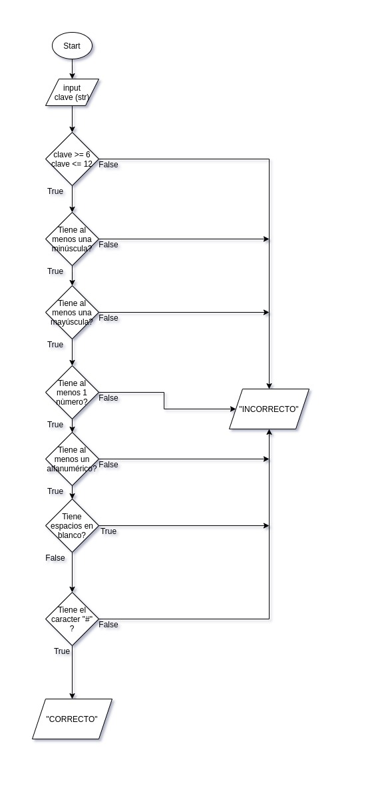

# Método IDEAL

## Identificar
* Cual es el problema?
  
  Vulnerabilidad en las contraseñas del correo de los estudiantes de _Misión TIC_.

* Cuales son los interesados?

  El programa de Misión TIC.

* Cual es el objetivo?

  Crear accesos seguros con claves seguras.

* Existen restricciones?

  * La contraseña debe tener al menos 6 caracteres.
  * La contraseña debe tener máximo 12 caracteres.
  * debe contener letras minúsculas.
  * debe contener al menos unas mayúsculas.
  * debes tener al menos un número
  * debes tener al menos 1 carácter no alfanumérico
  * no puede contener espacios en blanco
  * debe tener al menos un “#”

## Definir

  * Que conozco?

    * Clave (str)

  * Que debo conocer?

    * Mensaje (CORRECTO) - str
    * Mensaje (INCORRECTO) - str
    
  * Dividir el problema en subproblemas

    * Solicitar la contraseña.
    * Verificar si cumple cada una de las condiciones.
    * Evaluar la contraseña y decir si es válida o no.

## Estrategia

  * Hacer ejemplos particulares para entender el problema y sus subproblemas.

    * clave: Abcd123*#, mensaje: CORRECTO

    * clave: acd123, mensaje: INCORRECTO

  * Identificar opciones y estrategias de solución general.

    * Solicitar la contraseña.

    * Verificar si la opción pertenece al grupo indicado.

    * Generar el correo según las condiciones indicadas por el stakeholder.

## Algoritmo

  * Especificar requisitos para cada subproblemas.
  * Escribir algoritmos para cada requisito.
  * Escribir el algoritmo general.
    
  * Realizar pruebas de escritorio.

## Logro --> Programa

  * Programar los algoritmos en Python.
  * Probar el programa.
