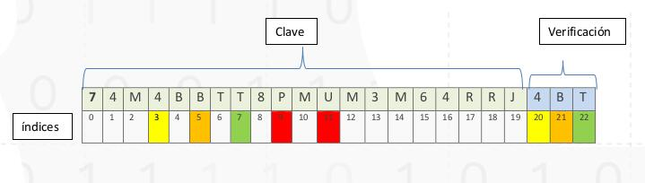
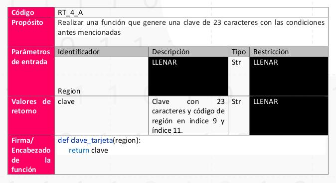

# Reto Módulo 4

## Objetivo
Utilizar los conocimientos adquiridos durante las semanas para solucionar problemas.

Implementar programas con expresiones lógicas y ciclos para resolver un problema que
involucre la toma de decisiones.

Descomponer un problema en subproblemas más pequeños y manejables para facilitar la
implementación del programa.

Construir funciones con parámetros para organizar el código fuente y facilitar la
reutilización de código.

Invocar funciones con argumentos válidos para facilitar la comprensión y el seguimiento de
programas.

Demostrar la importancia de reutilizar de código mediante la implementación de funciones
en módulos propios.

Aplicar la estrategia de dividir y conquistar para solucionar problemas

## Descripción del Reto

El programa de Misión Tic te agradece por tu ayuda en el ataque de seguridad que ya ha
sido solucionado gracias a tu ayuda verificando claves seguras, sin embargo, necesitamos
de nuevo tu asistencia para poder mandar tarjetas de claves que permitirán la descarga de
contenido digital para los niños de Colombia puedan estudiar tranquilos. Inicialmente nos
enfocaremos en 5 regiones del país __(AMAZONAS, CHOCO, GUJIRA, ARAUCA Y PUTUMAYO)__
es por esto por lo que necesitamos tu ayuda.

Tu puedes ánimo!

## Aspectos para tener en cuenta

Se ha logrado identificar que LAS CLAVE de 20 caracteres alfanuméricos es seguro, además se
quiere introducir seguridad adicional por eso Min Tic quiere agregar 3 Caracteres alfanuméricos de
verificación más una seguridad adicional como las tarjetas de crédito que corresponderá a las
iniciales de las zonas donde será distribuidas el contenido digital. POR LO TANTO, la clave TENDRA
23 CARACTERES ALFANUMERICOS (no tiene caracteres especiales ni espacios).

Es por esto por lo que se te pide que cumplas las siguientes condiciones

La clave corresponderá a la siguiente imagen

Es de notar que el código de verificación esta dado por las siguientes condiciones:

* El valor del índice 3 es igual al valor del índice 20
* El valor del índice 5 es igual al valor del índice 21
* El valor del índice 7 es igual al valor del índice 22

Adicionalmente se tiene Extra seguridad con el código de la región, por ejemplo:

* Para la región de PUTUMAYO *ver color rojo
    * Índice 9 = P
    * Indice 11 = U
* Para la región de AMAZONAS
    * Índice 9 = A
    * Índice 11 = M
* Para la región de CHOCO
    * Índice 9 = C
    * Indice 11 = H

1. Crear una función que genere una clave aleatoria con 23 dígitos donde el digito 9 y
11 corresponda a las iniciales de una región dada y los últimos 3 a los códigos de
verificación

Confiamos en ti y tus destrezas sabemos que es una tarea dura, pero creemos que eres
capaz, por eso te contratamos. Recuerda que la educación esta en tus manos si necesitas
ayuda puede contactarme o al tutor que con gusto te guiaría en esta dura tarea.

Por otro lado, recuerda que en replit ya hicimos un ejercicio de contraseñas puedes
utilizarlo como base.

Recuerda usar listas para resolver este ejercicio

## ¿Qué debes hacer?
1. Aplicar el proceso IDEAL completamente, es decir.

    a. Identificar el problema

    b. Definir el problema

    c. Estrategias que dividan el problema

    d. Algoritmos condicionales

2. Implementar la aplicación en Python

    a. Utilizando instrucciones condicionales y ciclos

    b. Utilizando funciones para cadenas de caracteres(str)
    
    c. Definiendo funciones con parámetros

    d. Invocando funciones correctamente
    
    e. Documentando el código

    f. Probando la aplicación

    g. Invocando funciones de terceros

## Fecha Modo de entrega

Sábado 25 de junio de 2021 a las 23:59

Se debe subir a replit un documento explicando y aplicando las etapas del proceso IDEAL

Se debe escribir un programa en Python en la plataforma Replit para solucionar el problema,
siguiendo el esquema planteado por el docente.

¡Mucha suerte!
